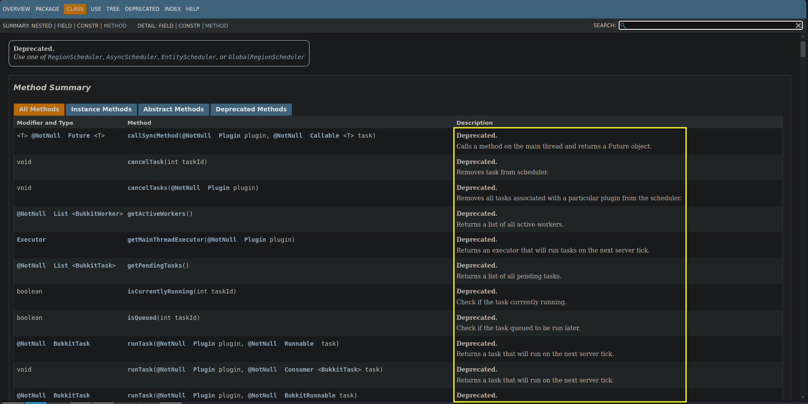

## 新年快乐！
作为2025年第一篇博客，我觉得我可以在这留下这句祝愿，祝你我在新的一年里事事顺利，心想事成！
## 前言
[Folia](https://papermc.io/software/folia)作为第一个正真意义上的多线程Minecraft服务端，插件系统不一定兼任Bukkit传统的插件。

但是其发展潜力依然非常大。

随着越来越多人开始关注它，越来越多的传统Bukkit插件陆陆续续开始适配Folia。但是粘液科技却不是

可能因为其庞大的代码量或者对Folia前景并没太大希望，粘液科技[并未计划适配Folia](https://github.com/Slimefun/Slimefun4/issues/4217)

在看到友商的Folia服务端性能表现后，我决定下个周末也使用Folia或其优化分支作为服务端。  

但是作为传统玩粘液科技的服务器，粘液科技并不适配。那怎么办？自己适配

故做此文章大致分享适配流程，按照我适配粘液科技的插件适配Folia的流程作为例子


本指北涉及插件源代码的修改且需要具有一定的Java语法基础，请提前确定自己熟悉基础的Java语法且可以修改插件源代码


## 差异性
先引用一段来自于PaperMC官方在Folia仓库README的描述(由边缘浏览器翻译)

>Bukkit Scheduler.Bukkit Scheduler 本身 依赖于单个主线程。Folia 的 RegionScheduler 和 Folia 的 EntityScheduler 允许将任务调度到任何 “next tick” 区域 “拥有” 位置或实体。这些是可以实现的 在常规 Paper 上，除了它们调度到主线程 - 在这两种情况下， 任务的执行将发生在 “拥有” location 或 entity。这个概念通常适用，因为目前的 Paper （单线程）可以看作是一个巨大的“区域”，它包括 所有世界中的所有区块。

这里的`Scheduler`就是适配的关键

在Bukkit中，`Scheduler`是Bukkit插件开发中一个重要的概念，它用于管理插件中的任务调度，定义了插件中任务的基本操作，如启动、取消、延迟执行等。

可以看到，PaperMC在Folia中将`Scheduler`进行了优化，将其分为例如`RegionScheduler`和`EntityScheduler`等不同类型的调度器，以实现对不同的调度。

在Folia的JavaDoc中，PaperMC已经将Bukkit Scheduler标记为了已弃用Deprecated。


## 思路
理论上，我们只需要将原本由BukkitAPI提供的`BukkitScheduler`改写为由PaperAPI提供的`RegionScheduler`和`EntityScheduler`，并改写`聊天`和`传送`等一起被废弃的旧API即可

如果要兼任Bukkit插件，只需要做一个服务器类型的判断，是Folia就使用`RegionScheduler`和`EntityScheduler`，否则使用`BukkitScheduler`即可

## 避免重复造轮子
查看大部分插件适配Folia的代码，主要分为两类

- 使用第三方包装库进行适配

- 自写或合并包装库适配

例如CoreProtect自写适配Utiles类，Mcmmo使用第三方包装库FoliaLib进行适配

本篇主要以使用第三方包装库进行适配为例，使用[FoliaLib](https://github.com/TechnicallyCoded/FoliaLib)进行适配，使用Idea作为编辑器
## 引入FoliaLib
### 添加依赖
最新版本如下，请将`pom.xml`中的`<version>`改为最新版本号[]()
#### Maven
在`pom.xml`中添加依赖,如下
```xml
<repositories>
    <repository>
        <id>jitpack</id>
        <url>https://jitpack.io</url>
    </repository>
</repositories>

<dependencies>
    <dependency>
        <groupId>com.github.technicallycoded</groupId>
        <artifactId>FoliaLib</artifactId>
        <version>改为上方便签写的版本号</version>
        <scope>compile</scope>
    </dependency>
</dependencies>

<build>
    
    <plugins>
        <!-- 导入shadow插件，如已导入，则将下列配置插入到plugins标签下 -->
        <plugin>
            <groupId>org.apache.maven.plugins</groupId>
            <artifactId>maven-shade-plugin</artifactId>
            <version>3.6.0</version>
            <executions>
                <execution>
                    <phase>package</phase>
                    <goals>
                        <goal>shade</goal>
                    </goals>
                </execution>
            </executions>
            <configuration>
                <relocations>
                    <relocation>
                        <pattern>com.tcoded.folialib</pattern>
                        <!-- !! 请确保将这里改为你插件的组名或插件名 !! -->
                        <shadedPattern>组名.插件名.lib.folialib</shadedPattern>
                    </relocation>
                </relocations>
            </configuration>
        </plugin>
        <!-- 终止线 -->
    </plugins>
</build>
```

#### Gradle
在`build.gradle.kts`中添加依赖,如下
```kotlin
plugins {
    id 'com.github.johnrengelman.shadow' version '8.1.1' // Java 17使用
    // id 'io.github.goooler.shadow' version '8.1.7' // Java 21或更高版本使用
}

repositories {
    maven {
        name = "jitpack"
        url = "https://jitpack.io"
    }
}

dependencies {
    implementation "com.github.technicallycoded:FoliaLib:main-SNAPSHOT"
}

shadowJar {
    // !! 请确保将这里改为你插件的组名或插件名
    relocate "com.tcoded.folialib", "组名.插件名.lib.folialib"

    // Optional: If you use minimize, make sure you exclude FoliaLib
    // Do not uncomment this if you don't know what you are doing
    // minimize {
    //     exclude dependency("com.github.technicallycoded:FoliaLib:.*")
    // }
}
```

### 初始化FoliaLib
编辑插件的主文件(onEnable方法的那个文件)，在项目中合理的地方合并插入以下代码  
**写法并不唯一，这里只是一个示例**
```java
import com.tcoded.folialib.FoliaLib;
import com.tcoded.folialib.wrapper.task.WrappedTask;

public final class 插件名 {
    private static FoliaLib foliaLib;

    @Override
    public void onEnable() {
        foliaLib = new FoliaLib(this);
    }

    public static FoliaLib getFoliaLib() {
        return foliaLib;
    }
}
```
之后即可通过调用主类获取FoliaLib实例，如`Slimefun.getFoliaLib.getScheduler()`

## 代替BukkitScheduler
### 一般Scheduler
只导入是不行的，需要使用FoliaLib提供的`Scheduler`类代替才可以适配  

FoliaLib提供的`Scheduler`类与BukkitScheduler类似，但在`命名`和`传入参数`等有少许不同，如类名
- `runTask` --> `runNextTick`

- `runTaskAsynchronously` --> `runAsync`

- `runTaskLater` --> `runLater`

- `runTaskTimerAsynchronously` --> `runTimerAsync`

- `runTaskLaterAsynchronously` --> `runLaterAsync`

- `scheduleSyncDelayedTask` --> `runLater`

- `scheduleSyncRepeatingTask` --> `runTimer`

这并非所有的类，更多类需要按自己需求选择

在传入参数中，foliaLib并不需要输入`Plugin`类，其他参数大致不变，分为`Runnable`和`Consumer<WrappedTask>`类的参数，其中`Runnable`和`Consumer<WrappedTask>`类只会出现一次，不会同时要求提供两个参数

### Task类
需要将原来使用的`BukkitTask`类替换为`WrappedTask`类，两者可以平滑替换，最多是导入类的报错，但是BukkitScheduler并不能接受`WrappedTask`类，WrappedTask类也是一样，所以一定要一一对应

### Scheduler类的Lambda表达式
一般的`() -> { }`类并不需要特别更改，但是如果有Idea报错的，如这种，可以参照如下示例更改
```diff
- Bukkit.getScheduler().scheduleSyncDelayedTask(this, new AutoUpdateTask(this, getFile()));
+ getFoliaLib().getScheduler().runAsync(wrappedTask ->  new AutoUpdateTask(this, getFile()));
```

### TaskID的改写
在BukkitScheduler中，`BukkitTask`类有`getTaskId()`方法，用于获取任务ID，而FoliaLib中，`WrappedTask`类没有`getTaskId()`方法，但是其会返回一个`WrappedTask`类型的值，可以用于`WrappedTask`中`cancelTask`方法`

如下是一个示例，来自[这个](https://github.com/SlimefunGuguProject/Slimefun4/blob/master/src/main/java/io/github/thebusybiscuit/slimefun4/implementation/tasks/player/AbstractPlayerTask.java)文件
``` diff
- private int id;
+ private WrappedTask task;

- private void setID(int id) {
-    this.id = id;
- }
+ private void setCancelTask(WrappedTask task){
+    this.task = task;
+ }

- public void schedule(long delay) {
-     setID(Bukkit.getScheduler().scheduleSyncDelayedTask(Slimefun.instance(), this, delay));
- }
+ public void schedule(long delay) {
+     setCancelTask(Slimefun.getFoliaLib().getScheduler().runLater(this,delay));
+ }

- public void scheduleRepeating(long delay, long interval) {
-     setID(Bukkit.getScheduler().scheduleSyncRepeatingTask(Slimefun.instance(), this, delay, interval));
- }
+ public void scheduleRepeating(long delay, long interval) {
+     setCancelTask(Slimefun.getFoliaLib().getScheduler().runTimer(this,delay,interval));
+ }

- public final void cancel() {
-     Bukkit.getScheduler().cancelTask(id);
- }
+ public final void cancel() {
+     Slimefun.getFoliaLib().getScheduler().cancelTask(task);
+ }
```

### 在生物或位置执行Scheduler
我们在文章开头就提到过
>Bukkit Scheduler.Bukkit Scheduler 本身 依赖于单个主线程。Folia 的 RegionScheduler 和 Folia 的 EntityScheduler 允许将任务调度到任何 “next tick” 区域 “拥有” 位置或实体。这些是可以实现的 在常规 Paper 上，除了它们调度到主线程 - 在这两种情况下， 任务的执行将发生在 “拥有” location 或 entity。这个概念通常适用，因为目前的 Paper （单线程）可以看作是一个巨大的“区域”，它包括 所有世界中的所有区块。

因此，部分的任务需要以这种方式调度，否则无法起作用，此部分涉及的更改较多，请参考以下commit进行更改
- [fix:grapplinghook cant use after it disappear](https://github.com/Craft233MC/Slimefun4/commit/0f78ba02fd9660b9c6732bf546917a4b6bf92522)

- [fix: runSync with entity or location](https://github.com/Craft233MC/Slimefun4/commit/92155ab48db3c3a1c7a5b7eb62a2cf4b51094508)

- [apply changes](https://github.com/Craft233MC/Slimefun4/commit/e71dbda9bef3b5964ac4a039518133dcaff2bc36)

对于的方法也需要提供，可以直接复制一份原有的代码，然后修改即可，即可实现共存不同的方法  
(这里我书写有点乱，一会要求提供的值在第一个，一会在最后一个，请见谅)
``` diff
    public static @Nullable WrappedTask runSync(@Nonnull Runnable runnable, long delay) {
        Validate.notNull(runnable, "Cannot run null");
        Validate.isTrue(delay >= 0, "The delay cannot be negative");

        // Run the task instantly within a Unit Test
        if (getMinecraftVersion() == MinecraftVersion.UNIT_TEST) {
            runnable.run();
            return null;
        }

        if (instance == null || !instance.isEnabled()) {
            return null;
        }

        return Slimefun.getFoliaLib().getScheduler().runLater(runnable, delay);
    }

+     public static @Nullable WrappedTask runSyncAtEntity(@Nonnull Runnable runnable, long delay, Entity e) {
+         Validate.notNull(runnable, "Cannot run null");
+         Validate.isTrue(delay >= 0, "The delay cannot be negative");
+ 
+         // Run the task instantly within a Unit Test
+         if (getMinecraftVersion() == MinecraftVersion.UNIT_TEST) {
+             runnable.run();
+             return null;
+         }
+ 
+         if (instance == null || !instance.isEnabled()) {
+             return null;
+         }
+ 
+         return Slimefun.getFoliaLib().getScheduler().runAtEntityLater(e ,runnable, delay);
+     }
+ 
+     public static @Nullable WrappedTask runSyncAtLocation(@Nonnull Runnable runnable, long delay, Location loc) {
+         Validate.notNull(runnable, "Cannot run null");
+         Validate.isTrue(delay >= 0, "The delay cannot be negative");
+ 
+         // Run the task instantly within a Unit Test
+         if (getMinecraftVersion() == MinecraftVersion.UNIT_TEST) {
+             runnable.run();
+             return null;
+         }
+ 
+         if (instance == null || !instance.isEnabled()) {
+             return null;
+         }
+ 
+         return Slimefun.getFoliaLib().getScheduler().runAtLocationLater(loc,runnable, delay);
+     }

    public static @Nullable WrappedTask runSync(@Nonnull Runnable runnable) {
        Validate.notNull(runnable, "Cannot run null");

        // Run the task instantly within a Unit Test
        if (getMinecraftVersion() == MinecraftVersion.UNIT_TEST) {
            runnable.run();
            return null;
        }

        if (instance == null || !instance.isEnabled()) {
            return null;
        }

        return Slimefun.getFoliaLib().getScheduler().runLater(runnable,1);
    }

+    public static @Nullable WrappedTask runSyncAtEntity(@Nonnull Runnable runnable, Entity e) {
+        Validate.notNull(runnable, "Cannot run null");
+
+        // Run the task instantly within a Unit Test
+        if (getMinecraftVersion() == MinecraftVersion.UNIT_TEST) {
+            runnable.run();
+            return null;
+        }
+
+        if (instance == null || !instance.isEnabled()) {
+            return null;
+        }
+
+        return Slimefun.getFoliaLib().getScheduler().runAtEntityLater(e,runnable,1);
+    }
+
+    public static @Nullable WrappedTask runSyncAtLocation(@Nonnull Runnable runnable, Location loc) {
+        Validate.notNull(runnable, "Cannot run null");
+
+        // Run the task instantly within a Unit Test
+        if (getMinecraftVersion() == MinecraftVersion.UNIT_TEST) {
+            runnable.run();
+            return null;
+        }
+
+        if (instance == null || !instance.isEnabled()) {
+            return null;
+        }
+
+        return Slimefun.getFoliaLib().getScheduler().runAtLocationLater(loc,runnable,1);
+    }
```

## getNearbyEntities方法
在Bukkit中可以用`getWorld().getNearbyEntities()`获取获取附近的实体，但是Folia中使用这个方法会出现错误，如以下报错
```re
java.lang.IllegalStateException: Cannot getEntities asynchronously
        at io.papermc.paper.util.TickThread.ensureTickThread(TickThread.java:86) ~[folia-1.20.6.jar:1.20.6-DEV-9a19e42]
        at net.minecraft.world.level.Level.getEntities(Level.java:1566) ~[folia-1.20.6.jar:1.20.6-DEV-9a19e42]
        at org.bukkit.craftbukkit.CraftWorld.getNearbyEntities(CraftWorld.java:1190) ~[folia-1.20.6.jar:1.20.6-DEV-9a19e42]
        at org.bukkit.craftbukkit.CraftWorld.getNearbyEntities(CraftWorld.java:1176) ~[folia-1.20.6.jar:1.20.6-DEV-9a19e42]
        at Slimefun-e96a898-Insider.jar/io.github.thebusybiscuit.slimefun4.core.services.holograms.HologramsService.getHologram(HologramsService.java:139) ~[Slimefun-e96a898-Insider.jar:?]
        at Slimefun-e96a898-Insider.jar/io.github.thebusybiscuit.slimefun4.core.services.holograms.HologramsService.lambda$updateHologram$0(HologramsService.java:253) ~[Slimefun-e96a898-Insider.jar:?]
        at Slimefun-e96a898-Insider.jar/io.github.thebusybiscuit.slimefun4.core.services.holograms.HologramsService.updateHologram(HologramsService.java:265) ~[Slimefun-e96a898-Insider.jar:?]
        at Slimefun-e96a898-Insider.jar/io.github.thebusybiscuit.slimefun4.core.services.holograms.HologramsService.setHologramLabel(HologramsService.java:317) ~[Slimefun-e96a898-Insider.jar:?]
        at Slimefun-e96a898-Insider.jar/io.github.thebusybiscuit.slimefun4.core.attributes.HologramOwner.updateHologram(HologramOwner.java:36) ~[Slimefun-e96a898-Insider.jar:?]
        at Slimefun-e96a898-Insider.jar/io.github.thebusybiscuit.slimefun4.core.attributes.HologramOwner.lambda$updateHologram$0(HologramOwner.java:52) ~[Slimefun-e96a898-Insider.jar:?]
        at Slimefun-e96a898-Insider.jar/io.github.thebusybiscuit.slimefun4.libraries.folialib.impl.FoliaImplementation.lambda$runLater$2(FoliaImplementation.java:111) ~[Slimefun-e96a898-Insider.jar:?]
        at io.papermc.paper.threadedregions.scheduler.FoliaGlobalRegionScheduler$GlobalScheduledTask.run(FoliaGlobalRegionScheduler.java:179) ~[folia-1.20.6.jar:?]
        at io.papermc.paper.threadedregions.scheduler.FoliaGlobalRegionScheduler.tick(FoliaGlobalRegionScheduler.java:37) ~[folia-1.20.6.jar:?]
        at io.papermc.paper.threadedregions.RegionizedServer.globalTick(RegionizedServer.java:293) ~[folia-1.20.6.jar:1.20.6-DEV-9a19e42]
        at io.papermc.paper.threadedregions.RegionizedServer$GlobalTickTickHandle.tickRegion(RegionizedServer.java:148) ~[folia-1.20.6.jar:1.20.6-DEV-9a19e42]
        at io.papermc.paper.threadedregions.TickRegionScheduler$RegionScheduleHandle.runTick(TickRegionScheduler.java:404) ~[folia-1.20.6.jar:1.20.6-DEV-9a19e42]
        at ca.spottedleaf.concurrentutil.scheduler.SchedulerThreadPool$TickThreadRunner.run(SchedulerThreadPool.java:525) ~[folia-1.20.6.jar:1.20.6-DEV-9a19e42]
        at java.base/java.lang.Thread.run(Thread.java:1583) ~[?:?]
```

因此需要重新实现这个方法  

代码出处: [Fix getting nearby entities on Folia](https://github.com/pop4959/Bolt/commit/3a4581587dcf93be810787c0ef26ddd19a4f8307)
```Java 
public Collection<Entity> getNearbyEntities(final Block block, final BoundingBox boundingBox, final Predicate<Entity> filter){
        final World world = block.getWorld();
        if (Slimefun.getFoliaLib().isFolia()) {
            final int minChunkX = boundingBox.getMin().getBlockX() >> 4;
            final int maxChunkX = boundingBox.getMax().getBlockX() >> 4;
            final int minChunkZ = boundingBox.getMin().getBlockZ() >> 4;
            final int maxChunkZ = boundingBox.getMax().getBlockZ() >> 4;
            final List<Entity> nearbyEntities = new ArrayList<>();
            for (int chunkX = minChunkX; chunkX <= maxChunkX; ++chunkX) {
                for (int chunkZ = minChunkZ; chunkZ <= maxChunkZ; ++chunkZ) {
                    if (!world.isChunkLoaded(chunkX, chunkZ)) {
                        continue;
                    }
                    final Chunk chunk = world.getChunkAt(chunkX, chunkZ);
                    if (!chunk.isEntitiesLoaded()) {
                        continue;
                    }
                    for (final Entity entity : chunk.getEntities()) {
                        if ((filter == null || filter.test(entity)) && boundingBox.overlaps(entity.getBoundingBox())) {
                            nearbyEntities.add(entity);
                        }
                    }
                }
            }
            return nearbyEntities;
        } else {
            return world.getNearbyEntities(boundingBox, filter);
        }
    }
```

## 聊天处理
这个问题发现于在使用粘液科技聊天栏搜索时，查看JavaDoc，PaperMC也给废弃了  

因此使用PaperMC提供的方法实现
```diff
-    public void onChat(AsyncPlayerChatEvent e) {
-        checkInput(e, e.getPlayer(), e.getMessage());
+    public void onChat(AsyncChatEvent e) {
+        String message = PlainTextComponentSerializer.plainText().serialize(e.message());
+        checkInput(e, e.getPlayer(), message);
```
这样实现对下游调用仍然是传入`Message`类型的值

## 传送处理
传送处理也存在问题，在Folia中，无法使用实体中`teleport`的类，会抛出以下类型的值
```re
java.lang.UnsupportedOperationException: Must use teleportAsync while in region threading
        at org.bukkit.craftbukkit.entity.CraftPlayer.teleport(CraftPlayer.java:1400) ~[folia-1.20.6.jar:1.20.6-DEV-9a19e42]
        at org.bukkit.craftbukkit.entity.CraftPlayer.teleport(CraftPlayer.java:1349) ~[folia-1.20.6.jar:1.20.6-DEV-9a19e42]
        at org.bukkit.craftbukkit.entity.CraftEntity.teleport(CraftEntity.java:226) ~[folia-1.20.6.jar:1.20.6-DEV-9a19e42]
        at Slimefun-555c4e0-Insider.jar/io.github.thebusybiscuit.slimefun4.implementation.listeners.GrapplingHookListener.handleGrapplingHook(GrapplingHookListener.java:174) ~[Slimefun-555c4e0-Insider.jar:?]
        at Slimefun-555c4e0-Insider.jar/io.github.thebusybiscuit.slimefun4.implementation.listeners.GrapplingHookListener.lambda$onArrowHitSurface$0(GrapplingHookListener.java:75) ~[Slimefun-555c4e0-Insider.jar:?]
        at Slimefun-555c4e0-Insider.jar/io.github.thebusybiscuit.slimefun4.libraries.folialib.impl.FoliaImplementation.lambda$runAtEntityLater$18(FoliaImplementation.java:366) ~[Slimefun-555c4e0-Insider.jar:?]
        at io.papermc.paper.threadedregions.scheduler.FoliaEntityScheduler$EntityScheduledTask.accept(FoliaEntityScheduler.java:168) ~[folia-1.20.6.jar:?]
        at io.papermc.paper.threadedregions.scheduler.FoliaEntityScheduler$EntityScheduledTask.accept(FoliaEntityScheduler.java:115) ~[folia-1.20.6.jar:?]
        at io.papermc.paper.threadedregions.EntityScheduler.executeTick(EntityScheduler.java:173) ~[folia-1.20.6.jar:1.20.6-DEV-9a19e42]
        at net.minecraft.server.MinecraftServer.tickServer(MinecraftServer.java:1688) ~[folia-1.20.6.jar:1.20.6-DEV-9a19e42]
        at io.papermc.paper.threadedregions.TickRegions$ConcreteRegionTickHandle.tickRegion(TickRegions.java:407) ~[folia-1.20.6.jar:1.20.6-DEV-9a19e42]
        at io.papermc.paper.threadedregions.TickRegionScheduler$RegionScheduleHandle.runTick(TickRegionScheduler.java:404) ~[folia-1.20.6.jar:1.20.6-DEV-9a19e42]
        at ca.spottedleaf.concurrentutil.scheduler.SchedulerThreadPool$TickThreadRunner.run(SchedulerThreadPool.java:525) ~[folia-1.20.6.jar:1.20.6-DEV-9a19e42]
        at java.base/java.lang.Thread.run(Thread.java:1583) ~[?:?]
```

虽然提示`region threading`，但是我在更改为`region threading`后，仍然会抛出这个错误，一种简单的修复方法如下
```diff
- player.teleport(location);
+ player.teleportAsync(location);
```

## 结尾
到这里就是文章结尾了，我尽量对整个过程进行回忆，以想到尽可能多的修改部分，如果有漏掉的地方，欢迎提出。  

整个过程是我自己主观的修改过程，如果有不对或需要修改的地方，欢迎通过以下方式提出

- [Craft233MC/Slimefun4/issues](https://github.com/Craft233MC/Slimefun4/issues)

- [me@neokoni.ink](maito:me@neokoni.ink)

如果你觉得这个项目对您有帮助，欢迎给我一个star或[DonateMe](https://dq.neokoni.ink)支持！