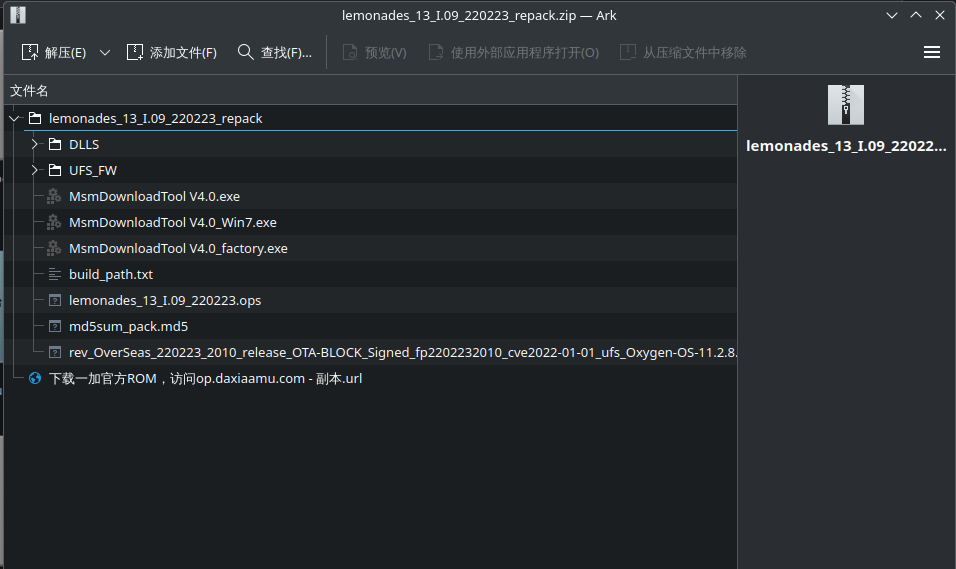
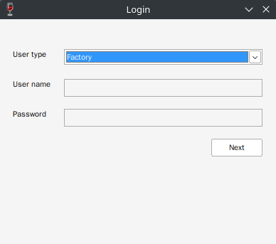
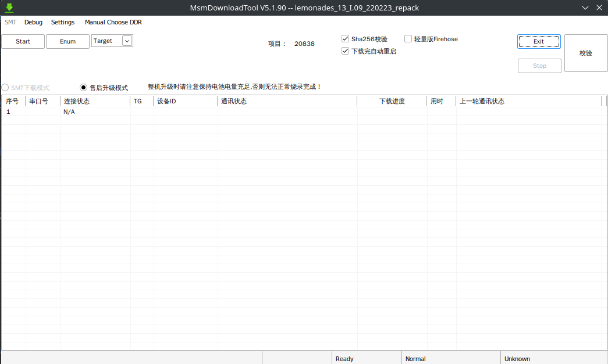

## 前言
因为以前一直用的红米K30 5G坏了，换了个二手的一加9R

因为刚开始刷的时候并不好找到相关资料或相关资料较老，所以走了点弯路，浪费了一下午的时间

所以出现了这一篇文章
## 提醒
先强调一点，刷机有风险，请慎重，若出现问题，请自行解决

底包首先，不能用ColorOS做底包，不然大多数都干不了

需要先刷入OxygenOS再进行正式的刷机步骤

问就是，我试过了，系统是ColorOS14有安卓2024.9安全补丁的那个

启动recovery直接卡住，除了xda上下载的那个twrp
## 流程
先介绍一下本次刷机的流程，有一个大概的框架

`刷入OxygenOS` > `解锁BootLoader` > `刷入基础文件` > `启动recovery` > `刷入复制分区文件` > `刷入刷机包` > `清除数据并重启`

为什么是先刷入OxygenOS再解锁Bootloader呢？因为在使用9008工具从ColorOS润到OxygenOS，在刷入完成后似乎会回锁Bootloader，这个就导致没必要先解锁一次

那么接下来，就是刷入的过程了
## 刷入OxygenOS
### 过渡降级法(未测试)
参看b站视频[BV1KA411L7X1](https://www.bilibili.com/video/BV1KA411L7X1)
### 9008线刷法
首先，我们要获取线刷包，这里可以到[大侠阿木](https://yun.daxiaamu.com/OnePlus_Roms_2/%E4%B8%80%E5%8A%A09R/9008%E7%BA%BF%E5%88%B7%E6%95%91%E7%A0%96%E5%8C%85%E6%B0%A7OS%2011.2.8.8/)下载救砖包恢复

解压后会得到如下图所示的文件



这一步需要在Windows环境下进行

接下来，安装9008驱动，此处资源来自[网站](https://www.thecustomdroid.com/qualcomm-hs-usb-qdloader-9008-drivers/)

- [64位版本](https://www.mediafire.com/file/5wc5nk5adevatrj/QDLoader_HS-USB_Driver_64bit_Setup.exe/file)

- [32位版本](https://www.mediafire.com/file/q1uynnim8arbim9/QDLoader_HS-USB_Driver_32bit_Setup.exe/file)

安装完成后运行解压后的刷机包中的`MsmDownloadTool V4.0.exe`

你将看到以下内容



因为我们并没有工厂账号，因此我们只能使用游客号

点击`Factory`所处的选择栏，选择`Other`并点击`Next`

接下来就是软件的主界面



接着，将手机关机，关机状态下按住`音量+`和`音量—`并同时插入与电脑连接的数据线

听到电脑响一声并且软件显示出设备就是进入9008了

接着点击左上角的`Start`开始刷入OxygenOS

这一步可能会报错`invalid try id()`应该是这个，有点记不清了

一部分人说这个需要去售后刷一次机，以后刷就不会报错了

但是这里，点击`Enum`右边的`Target`，在弹出的选项中选择`India`，然后重新点击`Start`

现在输入就应该没什么问题了，刷入完成后手机会重启，但不一定是直接进入系统

我的手机重启后在Bootloader，当显示绿色的Start时点击电源键启动手机

不是start可以按音量键切换

重启后第一次启动可能会提示`abnormal state`的提示以及一个`exit`的选项

选择`exit`接着选择`reboot`即可正常进入系统，目前是氧11,版本还是比较低

此时你可以选择一路使用系统的软件升级到最新版本或者手动选择固件本地升级

本地固件升级软件在[大侠阿木](https://yun.daxiaamu.com/files/%E5%B8%B8%E7%94%A8APP/%E6%9C%AC%E5%9C%B0%E5%8D%87%E7%BA%A7/)可以下载
## 解锁BootLoader
正常进入系统，打开开发者选项，点击打开oem解锁

手机进入bootloader,输入以下命令解锁

```bash
fastboot oem unlock
```

如果oem解锁为灰色，且显示"请连接互联网或联系您的运营商"

尝试登陆Google账号后重新查看，若登陆后依然为灰色，可以尝试直接解锁

我的手机就是这样

执行完命令，使用音量键切换选项，电源键选择，选择有"UNLOCK"字样的选项

之后会自动恢复出场设置，并且开机显示`Orange State`就是成功了
## 刷入基础文件
找到你刷机包下载的地方，一般应该会自带`dtbo.img``vbmeta.img``recovery.img`这三个文件

我们这里先刷入`dtbo`与`vbmeta`

```bash
fastboot flash dtbo dtbo.img
fastboot flash vbmeta vbmeta.img
```

文件适当替换为你自己的文件路径
## 启动Recovery
这里直接启动就够了，刷入完成后会自动使用包的rec

```bash
fastboot boot recovery.img
```
文件适当替换为你自己的文件路径
## 刷入复制分区文件
这一步来自[LineageOS的教程](https://wiki.lineageos.org/devices/lemonades/install/#ensuring-all-firmware-partitions-are-consistent)

引用下直译的话:

`在某些情况下，非活动插槽可能未填充或包含比活动插槽旧得多的固件，从而导致各种问题，包括潜在的硬砖。我们可以通过将活动槽的内容复制到非活动槽来确保不会发生这些情况。`

首先下载复制分区的文件[copy-partitions-20220613-signed.zip](https://mirrorbits.lineageos.org/tools/copy-partitions-20220613-signed.zip)

然后手机选择`Apply update`再选择`From ADB`

此时手机为adb sideload模式，此时运行adb命令，文件适当替换为你自己的文件路径
```bash
adb sideload copy-partitions-20220613-signed.zip
```
完成后选择`Advance`,再选择`Reboot to Bootloader`

之后再次启动Recovery，步骤一样
## 刷入刷机包
这里依然是使用adb sideload的方式刷入

然后手机选择`Apply update`再选择`From ADB`

此时手机为adb sideload模式，此时运行adb命令，文件适当替换为你自己的文件路径

```bash
adb sideload file.zip
```
file.zip替换为你自己的文件路径

比如我这里刷入我自编译的系统，则命令为
```example
adb sideload /home/Neokoni/Downloads/EverestOS-1.6-Lukla-EOL-lemonades-UNOFFICIAL-GAPPS-1700-20241010.zip
```
## 清除数据并重启
刷入完成后，找到`Factory reset`并选择`Format data/factory reset`即可清除

选择`Reboot to system`，刷机完成